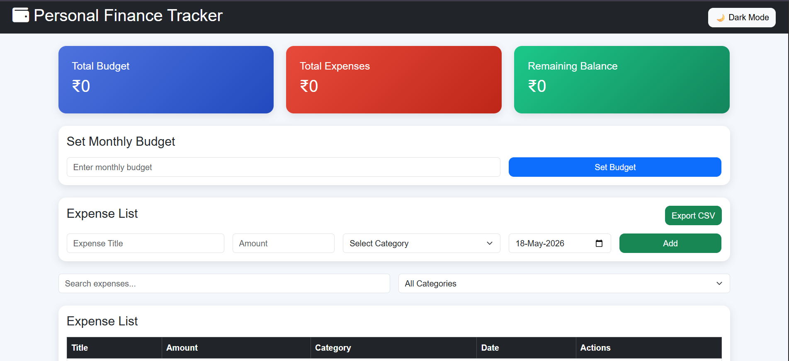
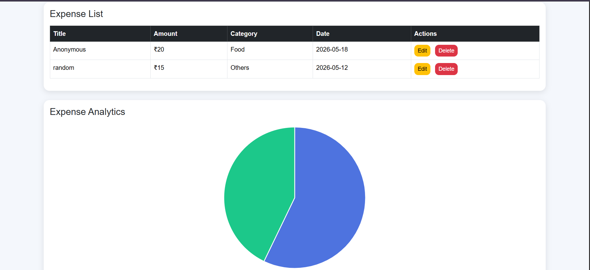
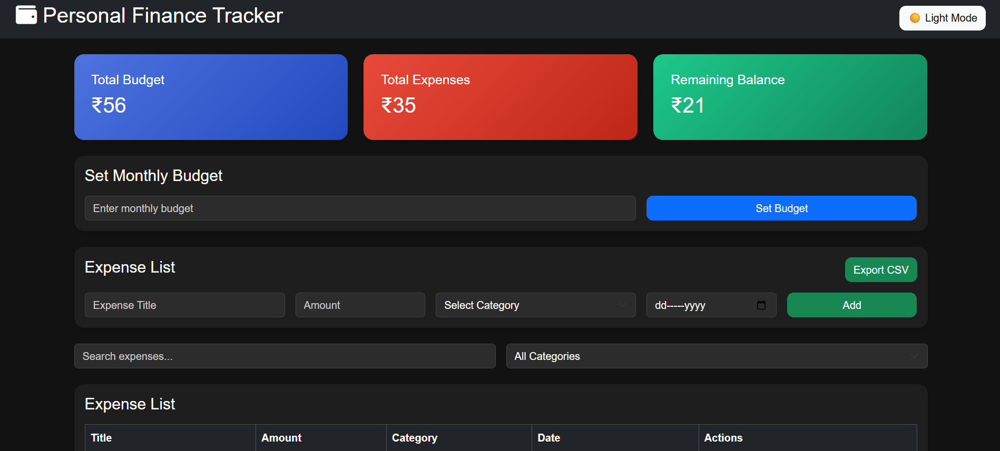
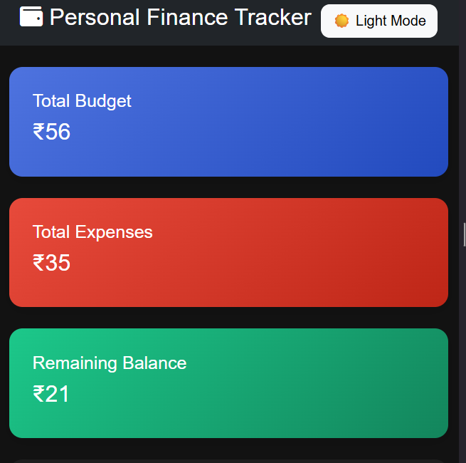
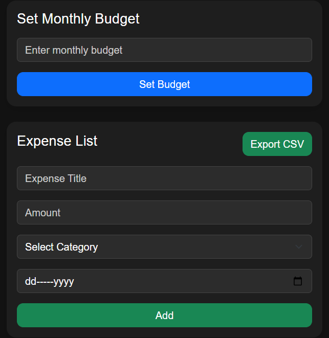

# Personal Finance Tracker

A responsive Personal Finance Tracker web application that helps users manage expenses, track budgets, and visualize spending patterns.

## Features

- Add, Edit, Delete Expenses
- Monthly Budget Management
- Remaining Balance Calculation
- Expense Search
- Category Filtering
- Expense Analytics Chart
- Dark/Light Mode
- CSV Export
- LocalStorage Persistence
- Responsive Design

## Technologies Used

- HTML5
- CSS3
- Bootstrap 5
- JavaScript (ES6)
- Chart.js

## Setup Instructions

1. Clone the repository
2. Open project folder
3. Run index.html in browser

## Folder Structure

```plaintext
project-folder/
│
├── index.html
├── style.css
├── script.js
├── README.md
```

## Future Enhancements

- User authentication
- Multiple budgets
- Cloud database integration
- Expense insights using AI

## Screenshots

### Dashboard
(assets/dashboard2.png)


### Dark Mode


### Mobile View


